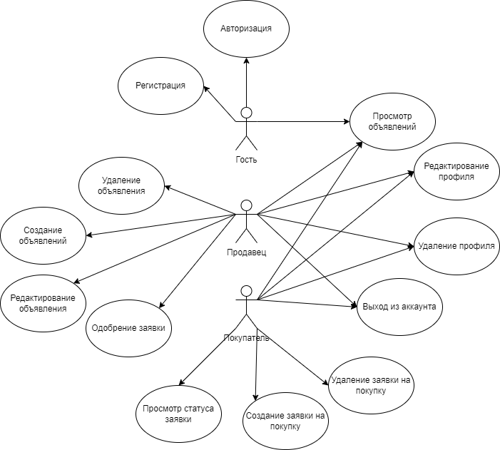
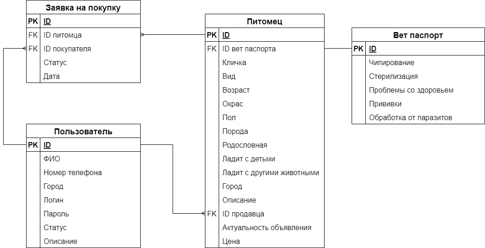

# GetAPet — Техническое задание (ТЗ)

**Проект:** GetAPet — агрегатор животных из приютов и от частных лиц  
**Версия:** 0.1

---

## 1. Описание артефактов и терминов (Глоссарий)

**GetAPet** — веб-сервис, объединяющий объявления о животных из различных приютов, фондов помощи животным и от частных лиц. Все объявления собраны в одном месте с возможностью фильтрации по виду, возрасту и местоположению.

**Животное (Animal)** — сущность каталога, представляющая конкретного питомца, доступного для поиска и просмотра.

**Приют (Shelter)** — организация или место, где содержатся животные и откуда публикуются объявления.

**Частное лицо (Owner)** — физическое лицо, размещающее объявление о пристройстве животного.

**Карточка животного** — страница с полной информацией о конкретном питомце.

**Каталог животных** — список доступных животных с возможностью фильтрации и поиска.

**Фильтр поиска** — механизм, позволяющий ограничивать список животных по определённым параметрам (город, тип животного, возраст и т.д.).

**Тип животного** — классификация животного (например: кошка, собака, птица).

**Город** — географическая привязка приюта или животного.

**Пользователь (гость)** — посетитель сайта, который просматривает каталог животных.

**Продавец (Seller)** — пользователь, размещающий объявления о питомцах.

**Покупатель (Buyer)** — пользователь, подающий заявки на покупку / передачу питомца.

---

## 2. Продуктовое описание

### 2.1 Назначение системы

**GetAPet** предназначен для упрощения поиска домашних животных, находящихся в приютах или передаваемых от частных лиц.  
Сервис собирает объявления о животных в одном месте и позволяет пользователям быстро найти питомца с помощью фильтрации и просмотра карточек животных.

### 2.2 Цели и задачи

Многие люди мечтают завести питомца, но сталкиваются с разрозненной информацией о приютах, фондах, частных объявлениях и доступных животных.  
**GetAPet** появился, чтобы помочь людям и животным найти друг друга.

Система решает следующие ключевые задачи:
- объединить объявления из различных приютов и от частных лиц;
- упростить поиск питомца;
- повысить видимость животных, нуждающихся в доме;
- сэкономить время пользователя на поиск подходящего питомца.

Идея проста: объединить мечты людей о питомце и заботу о животных в удобной платформе.

### 2.3 MVP

MVP-версия системы включает:
1. Каталог животных (удобная карточка каждого питомца с фото и подробным описанием характеристик).
2. Расширенный фильтр по городу, типу животного и другим параметрам.

### 2.4 Связанные артефакты проекта

Для управления проектом и анализа рисков используются дополнительные артефакты:
- **p3express по проекту GetAPet** — описание подготовки и планирования проекта, см. раздел Wiki: [`p3express`](https://github.com/proGsa/GetAPet/wiki/p3express).
- **Таблица рисков проекта** — анализ ключевых рисков и стратегий работы с ними, см. раздел Wiki: [`Таблица рисков`](https://github.com/proGsa/GetAPet/wiki/%D0%A2%D0%B0%D0%B1%D0%BB%D0%B8%D1%86%D0%B0-%D1%80%D0%B8%D1%81%D0%BA%D0%BE%D0%B2).
- **PERT-диаграмма по проекту** — описание задач проекта, их длительности и зависимости, см. раздел Wiki: [`PERT`](https://github.com/proGsa/GetAPet/wiki/PERT).

---

## 3. Команда проекта

- **Софья Беляк**  
  

- **Наталия Гончар**  
  

- **Анастасия Лобач**  
  

- **Людмила Фролова**  
  

---

## 4. Функциональное описание

Ниже представлена диаграмма вариантов использования, отражающая основные сценарии работы пользователей с системой, роли участников (**гость**, **продавец**, **покупатель**) и их взаимодействие с системой.



### 4.1 Регистрация и авторизация

**Гость** может:
- зарегистрироваться в системе (создать учётную запись);
- авторизоваться под существующим аккаунтом;
- после авторизации получить роль **продавца** или **покупателя** в зависимости от сценария использования.

### 4.2 Просмотр объявлений

**Гость**, **покупатель** и **продавец** могут:
- просматривать список доступных объявлений о животных;
- применять фильтры (по городу, виду животного, возрасту и др.);
- открывать детальную карточку объявления с информацией о питомце и продавце.

### 4.3 Управление объявлениями (продавец)

**Продавец** может:
- создавать новые объявления о питомцах;
- редактировать существующие объявления (изменять описание, цену, статус актуальности и т.п.);
- удалять объявления, которые больше не актуальны.

### 4.4 Работа с заявками (покупатель и продавец)

**Покупатель** может:
- создавать заявку на покупку выбранного питомца;
- просматривать статус своей заявки;
- отменять (удалять) заявку на покупку.

**Продавец** может:
- просматривать входящие заявки на своих питомцев;
- одобрять или отклонять заявки покупателей.

### 4.5 Управление профилем пользователя

**Покупатель** и **продавец** могут:
- редактировать свой профиль (контактные данные, описание и т.д.);
- удалить свой профиль;
- выйти из аккаунта.

---

## 5. Техническое описание

### 5.1 Архитектура системы

Система реализуется как монолитное веб-приложение.

Архитектура включает следующие компоненты:
- **Frontend** — пользовательский интерфейс;
- **Backend** — серверная логика приложения;
- **Database** — база данных для хранения информации.

Взаимодействие между frontend и backend осуществляется через HTTP API.

### 5.2 Технологический стек

- **Фронтенд:** TypeScript + React + Vite + HTML/CSS  
- **Бэкенд:** Go  
- **Архитектура:** монолитный сервис  
- **База данных:** PostgreSQL (реляционная база данных)  
- **Контейнеризация / инфраструктура:** Docker, Docker Compose — для удобного разворачивания и изоляции приложения

### 5.3 Основные сущности базы данных

Ниже приведена ER-диаграмма, отображающая взаимосвязи основных сущностей базы данных:



#### `vet_passport`

Хранит ветеринарную информацию о питомце:
- `id` — уникальный идентификатор записи;
- `chipping` — признак чипирования (BOOLEAN);
- `sterilization` — признак стерилизации (BOOLEAN);
- `health_issues` — проблемы со здоровьем (TEXT);
- `vaccinations` — прививки (список дат, TEXT);
- `parasite_treatments` — обработки от паразитов (список дат, TEXT).

#### `users`

Содержит информацию о пользователях (покупателях, продавцах, владельцах животных):
- `id` — уникальный идентификатор пользователя;
- `fio` — ФИО пользователя;
- `telephone_number` — номер телефона;
- `city` — город пользователя;
- `user_login` — логин (уникальный);
- `user_password` — пароль;
- `status` — статус пользователя (например, buyer, seller);
- `user_description` — дополнительная информация о пользователе.

#### `pet`

Содержит информацию о питомцах и объявлениях:
- `id` — уникальный идентификатор питомца;
- `vet_passport_id` — ссылка на ветпаспорт (`vet_passport.id`);
- `seller_id` — ссылка на владельца / продавца (`users.id`);
- `pet_name` — кличка питомца;
- `species` — вид животного (например: кошка, собака);
- `pet_age` — возраст питомца;
- `color` — окрас;
- `pet_gender` — пол питомца;
- `breed` — порода;
- `pedigree` — наличие родословной (BOOLEAN);
- `good_with_children` — ладит ли с детьми (BOOLEAN);
- `good_with_animals` — ладит ли с другими животными (BOOLEAN);
- `pet_description` — дополнительная информация о питомце;
- `is_active` — актуальность объявления (BOOLEAN);
- `price` — цена питомца.

#### 5.3.4 `purchase_request`

Хранит заявки на покупку / передачу питомца:
- `id` — уникальный идентификатор заявки;
- `pet_id` — ссылка на питомца (`pet.id`);
- `seller_id` — ссылка на продавца / текущего владельца (`users.id`);
- `status` — статус заявки (например: pending, approved, rejected);
- `request_date` — дата и время создания заявки.

---

## 6. Условия эксплуатации

### 6.1 Серверная часть

Минимальные требования:
- ОС: Linux / Windows;
- CPU: 2 ядра;
- RAM: 2 ГБ;
- установленный Docker.

### 6.2 Клиентская часть

Поддерживаемые браузеры:
- Google Chrome;
- Mozilla Firefox;
- Microsoft Edge.

---

## 7. Правила выгрузки (Deployment)

Система разворачивается с использованием Docker и Docker Compose.

Команда запуска:

```bash
docker compose up -d --build
```
---


## 8. Критерии приёмки MVP

MVP считается реализованным, если:

1. Пользователь может зарегистрироваться и авторизоваться в системе.
2. Продавец может создать, отредактировать и удалить объявление о питомце.
3. Покупатель может просматривать объявления и создать заявку на покупку питомца.
4. Продавец может просмотреть и одобрить или отклонить заявку покупателя.
5. Фильтрация объявлений по городу и виду животного работает корректно.
6. Система успешно разворачивается и запускается с помощью Docker Compose.

